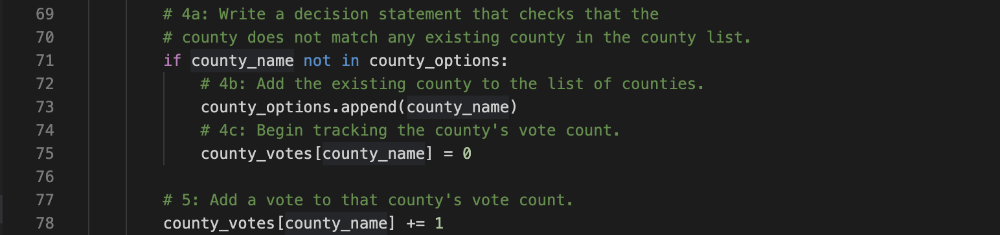
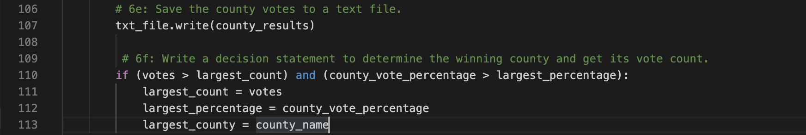
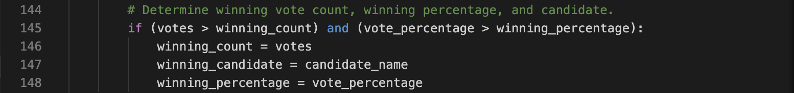

# Challenge Assignment - Election Audit
## Overview
The purpose of this audit is twofold. In the first portion, we created a script in Python that can:

1. Calcuate the total number of votes cast.
2. Get a complete list of candidates who recieved votes.
3. Calculate the total number of votes each candidate received.
4. Calculate the percentage of votes each candidate won.
5. Determine the winner of the election based on popular vote.

In the second portion, we modified our script to also tally the number of votes per county so that we can calculate the percentage of votes from each county out of the total count. This is important for congressional elections since the winning candidate will represent these districts in Congress. We can use the total votes per county to confirm that the sum of all counties equals the total votes cast in the election. The modified script can also inform us which county had the largest number of votes.

## Resources
- Data Source: election_results.csv
- Software: Python 3.7.6, Visual Studio Code, 1.51.0
- Code example images

## Results

  

  1. *How many votes were cast in this congressional election?*
  
      There were a total of **369,711 votes** cast in the election.

  2. *Provide a breakdown of the number of votes and the percentage of total votes for each county in the precinct.*
  
      There were three counties that cast votes in this election: Jefferson county, Denver county, and Arapahoe county. To tally the votes by county, we created an if statement within a for loop that checks the county name for each vote and adds it to a a list of counties if the county has not been added already. Then we initialize the county vote to zero and begin tracking votes by county for each row in our election_results.csv file. 

  

      The results are as follows:

      - Jefferson county represented 10.5% of the total vote with 38,855 votes cast.
      - Denver county represented 82.8% of the total vote with 306,055 votes cast.
      - Lastly, Arapahoe county represented 6.7% of the total vote with 24,801 votes cast.

  3. *Which county had the largest number of votes?*

      Denver county.

      To determine which county had the largest number of votes, we created an if statement that checks if the votes for the county are greater than the largest vote count (by county), AND that the percentage of votes from that county out of the total was greater than the largest percentage (by county). 

      

  
  4. *Provide a breakdown of the number of votes and the percentage of the total votes each candidate recieved.*
  
      There were three candidates that recieved votes in this election: Charles Casper Stockham, Diana DeGette, and Anthony Doane. To tally the votes by candidate, we created an if statement within a for loop like we did for counties. Each time a candidate's name appeared in the eleciton_results.csv file, one vote was added to their total.

      

      The results were as follows:

        - Charles Casper Stockham recieved 23.0% of the vote with 85,213 votes.
        - Diana DeGette recieved 73.8% of the vote with 272,892 votes.
        - Anthony Doane recieved 3.1% of the vote with 11,606 votes.

  5. *Which candidate won the election, what was their vote count, and what was their percentage of the total votes?*

      The winner of the election was Diana DeGette, who recieved 73.8% of the vote with 272,892 votes.

      Similarly to determining the largest county, the winning cancidate was determined using an if statement checking that both vote count and percentages of total votes for that candidate were greater than the other candidates.

      

## Audit Summary
The script written for this election audit can be used to analyze results from other elections as well. The script may need to be modified depending on the format of the results data. For instance, if there are additional columns or the candidate name or county are located in different columns, the variables for candidate name and county name will need to be changed to relfect the accurate location of this information within the csv file.

This script can also be modified to audit ballot IDs to ensure that each ballot was counted only once. To do so, we can create an empty list to track ballots and within the for loop that loops over each row in the csv file, we can write an if statement that checks to see if the ballot ID is already in the list. If it is, the ID of the duplicate ballot can be printed to the results file or terminal. Otherwise, we can prompt the script to print "No duplicate ballot IDs detected" as confirmation.

